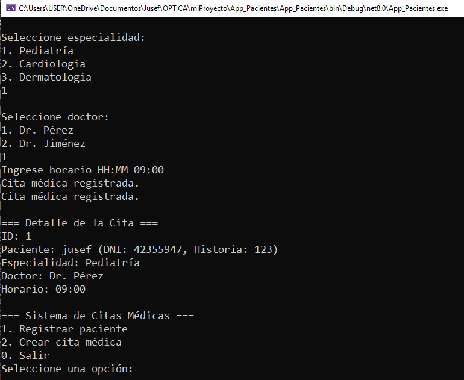

Sistema de Citas

#Descripcion

El sistema permite ingresar información de un paciente y la creación de una cita.

#Manual de usuario

El sistema contiene un menu con las siguientes opciones
1. Registrar Paciente: Esta opción permite al usuario ingresar el nombre, dni y número de historia del
paciente, al termino del cual aparecerá un mensaje de "Paciente Registrado" como confirmación del proceso.
2.Crear cita medica: Esta opcion permite buscar a través del dni al paciente para luego seleccionar
la especialidad al cual desea separar cita (Pediatría, Cardiología y Dermatología). Una vez que se elige la
especialidad se seleccionar al doctor y luego la hora de la cita en formato HH:MM (hora y minuto)
3. Por último seleccionar la opción de salir del sistema.